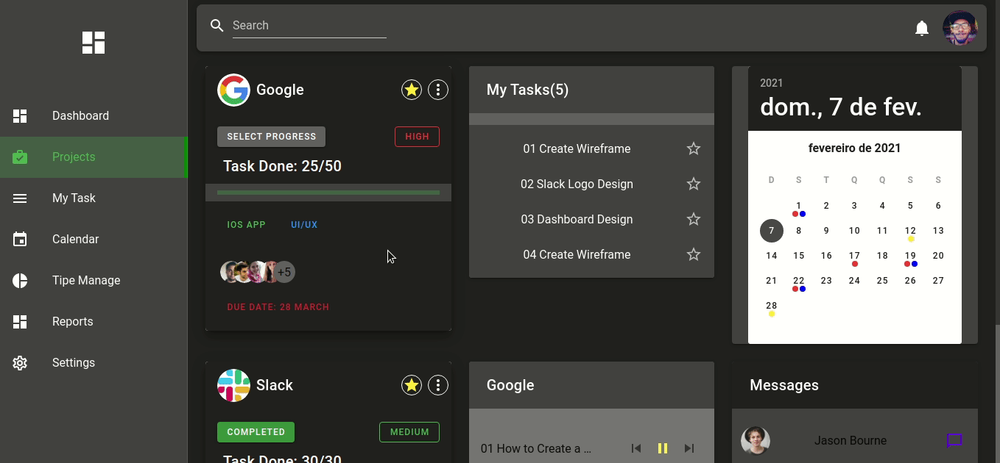

# Taskz



# Description
Another Study Case to skill improvement.
## Project setup
```
yarn install
```

### Compiles and hot-reloads for development
```
yarn serve
```

### Compiles and minifies for production
```
yarn build
```

### Customize configuration
See [Configuration Reference](https://cli.vuejs.org/config/).
